## Materials in Unity

In Unity, materials define the appearance of an object’s surface in terms of how it interacts with light. They are associated with objects through a material component, which is attached to the object’s mesh. Materials in Unity can be as simple or complex as needed, depending on the requirements of the project. They can define properties such as color, texture, reflectivity, and transparency.

### Get Started with Materials

1. Use Assets->Create->Material from the main menu or the Project View context menu.

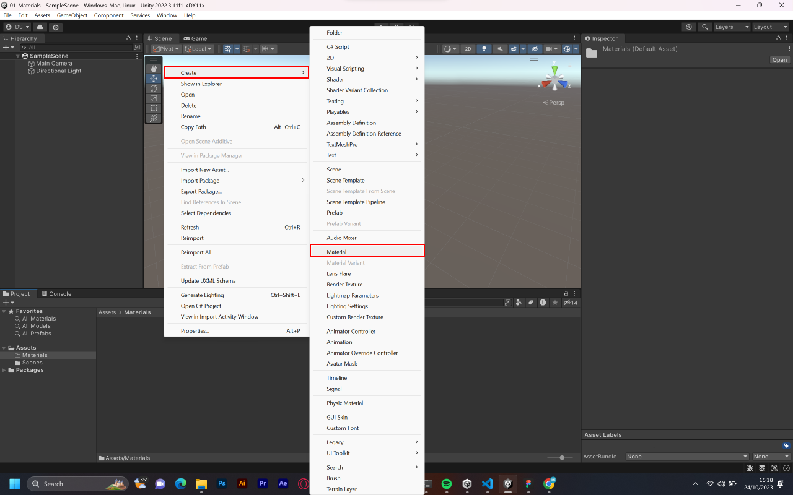

2. By default, new materials are assigned the Standard Shader.

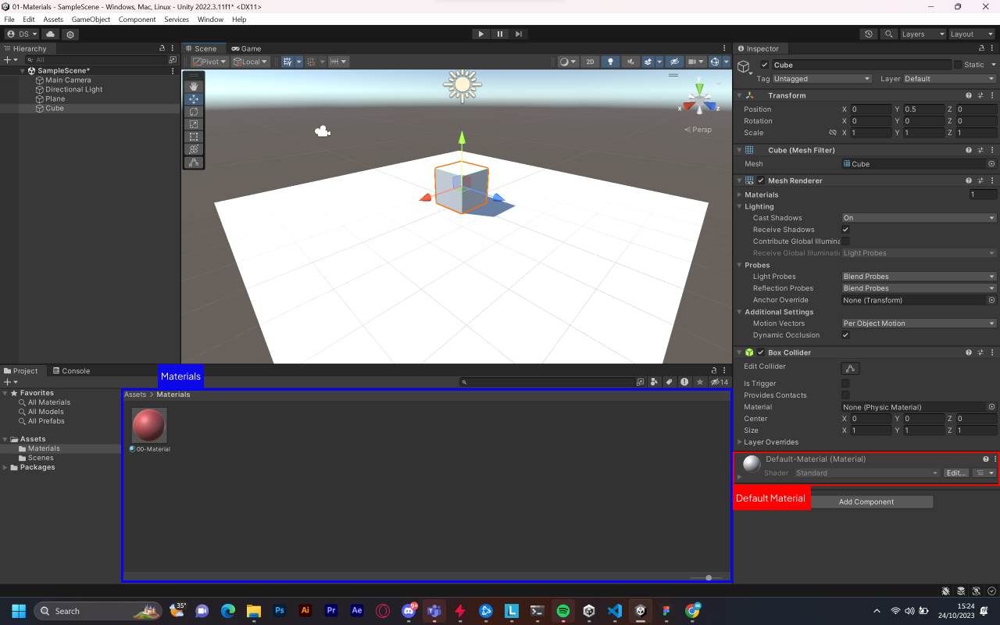

3. Once the Material has been created, you can apply it to an object and tweak all of its properties in the Inspector.

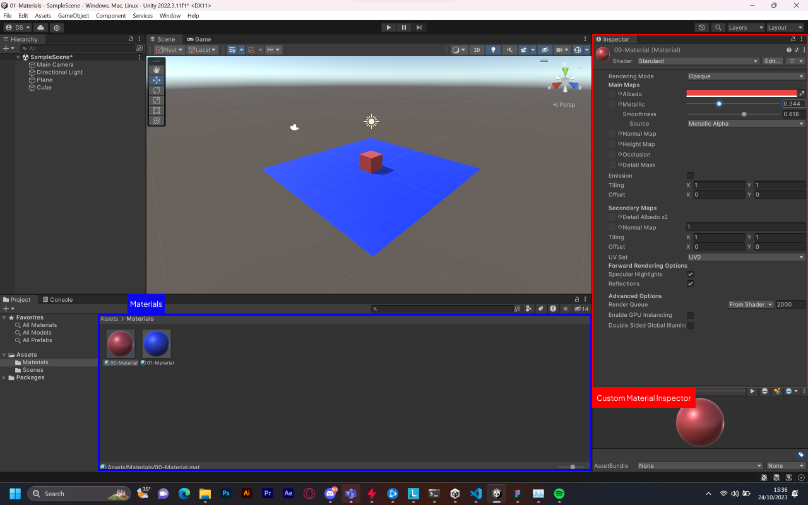

4. To apply it to an object, just drag it from the Project View to any object in the Scene or Hierarchy.

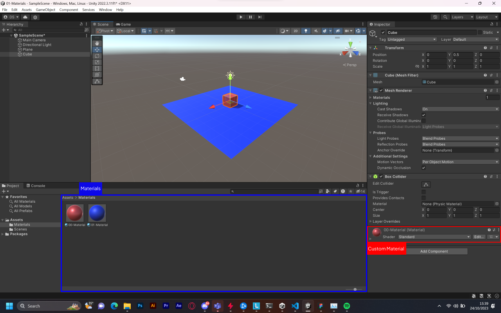

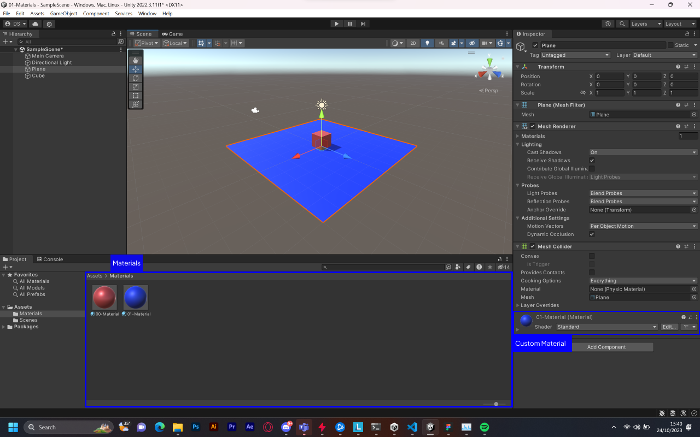

### Setting Material Properties:

- You can select which Shader you want any particular Material to use.
- The Shader you choose will dictate the available properties to change.
- The properties can be colors, sliders, textures, numbers or vectors.
- If you have applied the Material to an active object in the Scene, you will see your property changes applied to the object in real-time.

In addition to the Standard Shader, there are a number of other categories of built-in shaders for specialized purposes: FX (Lighting and glass effects), GUI and UI (User Interface), Mobile (Simplified high-performance shader for mobile devices), Nature (For trees and terrain), Particles (Particle system effects).

### Material with Texture

In 3D modeling, both normal maps and diffuse maps are types of texture maps, but they serve different purposes:

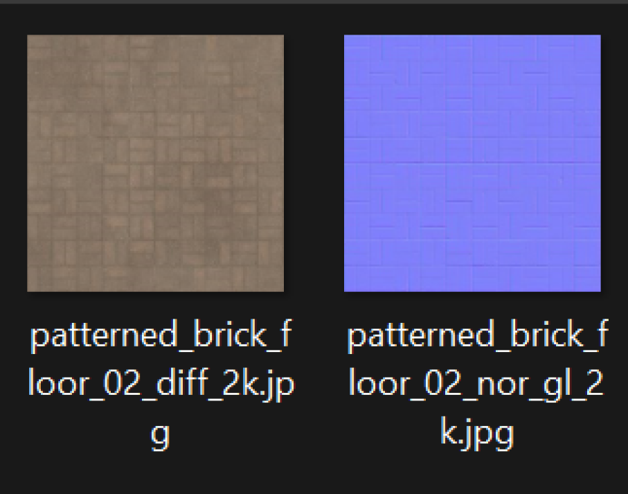

- **Diffuse Map**: This is the raw color channel of a 3D object. It defines the base color of a surface or how light is absorbed when it hits the surface1. It shows the color of the object without light effects1. Essentially, it’s a 2D image that is wrapped onto the 3D model to give it color and detail1.

- **Normal Map**: This is a technique used for faking the lighting of bumps and dents. It is used to add details without using more polygons. A normal map uses RGB information that corresponds to the X, Y, and Z coordinates of the surface normals of the object, creating the illusion of depth detail on a 3D model. This can give a low-polygon model the appearance of a higher-resolution mesh.

We can apply a texture to a material by dragging the texture from the Project View to the Albedo property of the material in the Inspector.

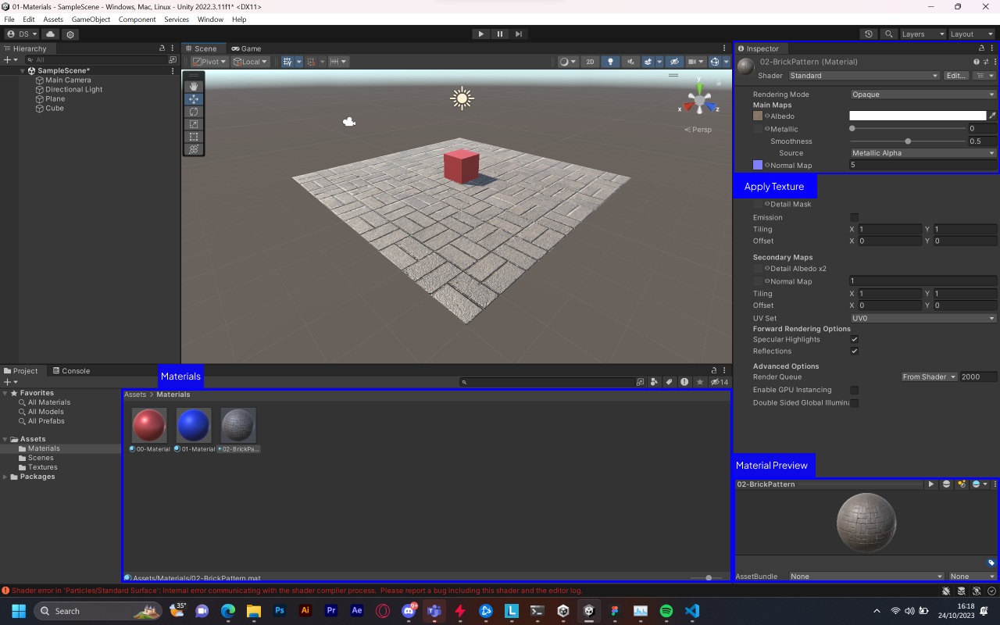

In summary, while a diffuse map represents color information, a normal map represents surface detail (bumps and dents)

## Shader in Unity
Shader is a script that applies the properties contained in a material to render the meshes of your 3D objects to the 2D image on your screen. Each shader is written for a specific render pipeline.

### Types of Shaders
There are two types of operations that occur in a shader: fragment shading and vertex shading.

 - **Fragment shading**, also known as pixel shading, is the shading that represents mesh surfaces to produce the color of each pixel in the 2D image.

 - **Vertex shading** operates on the vertices of the mesh, typically changing their locations to make the surface move or transform.

### Shaders in the Universal Render Pipeline
Shaders must be compatible with the render pipeline of a project.

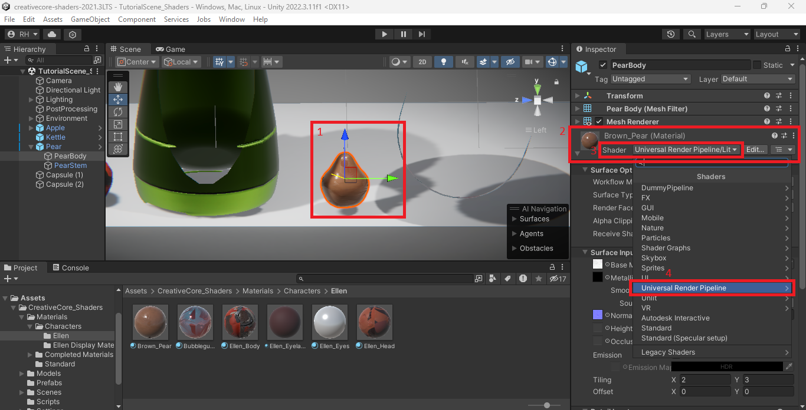

1. Select an object with material applied on your workbench.
2.  In the Inspector, locate the Material Inspector at the bottom of the Inspector window, and expand that section if necessary.
3.  At the top of the Material Inspector, near the thumbnail of the material, locate the Shader property.
4.  Use the dropdown to view the list of shader categories. Select Universal Render Pipeline to see the URP shaders.
5.  With the object selected, select each of the URP shaders.
    - 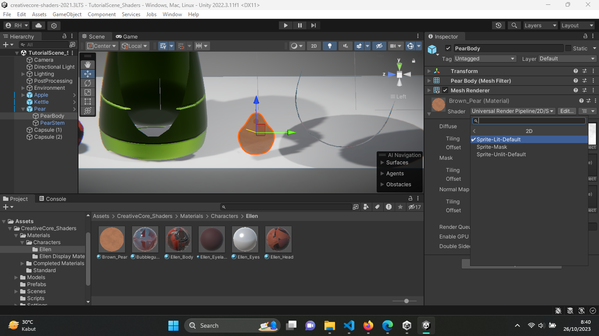 
    2D > Sprite-Lit-Default: Designed for 2D projects, this shader is for flat objects only and will render any 3D object as 2D. As a lit shader, it will render based on the light in the scene that reaches the object.
    - 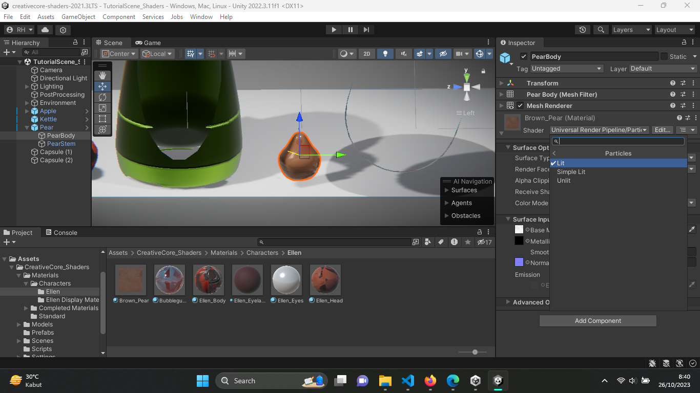 
    Particles > Lit, Simple Lit, and Unlit: These shaders are for visual effects (VFX). In the Creative Core pathway, you will use these shaders in the VFX mission.
    - 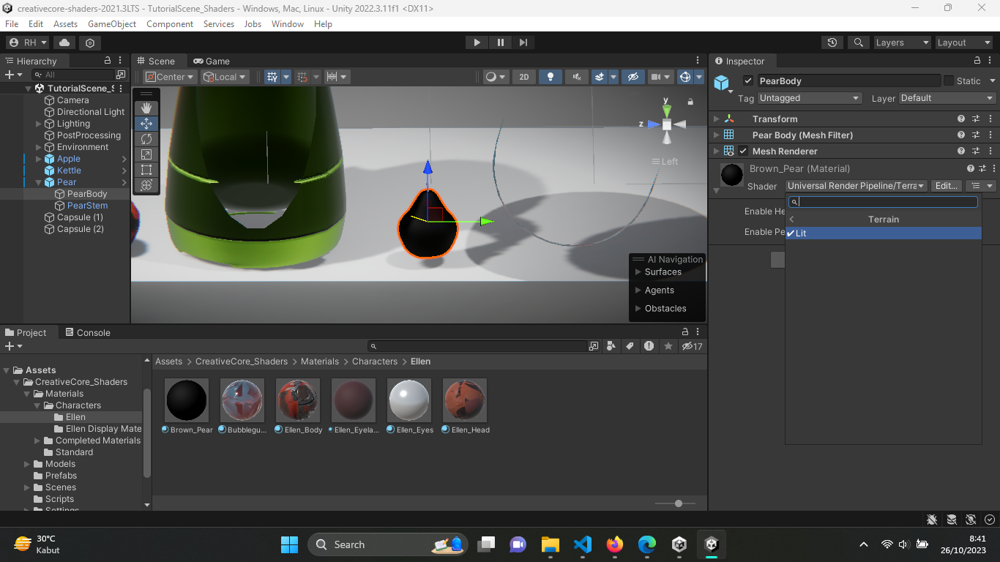 
    Terrain > Lit: This shader is optimized for use with the Terrain tools in Unity. In the Creative Core pathway, you will use this shader in the Prototyping mission.
    - 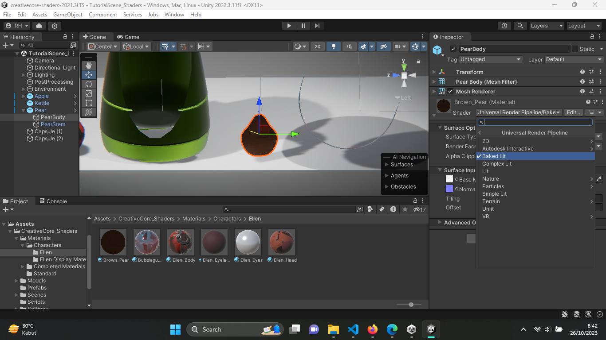 
    Baked Lit: This shader is automatically applied to lightmaps, which you will encounter in the Creative Core pathway’s Lighting mission.

## Material Variant
Many of the materials in a game are variations of other. Outfits with a variety of color schemes, damaged and undamaged versions of items, shiny and weathered instances of props.

- Automatically changes if its parent changes.
- You can copy changes from a child material to its parent with two mouse clicks.
- You can lock one or more Properties on a Material or Material Variant to prevent modifications to those Properties in its children.
- You can reparent Material Variants.

### Create, modify, and apply Material Variants
1. Create a Material Variant
    a. Right-click on a Material in the Project window, then select `Create > Material Variant`.
    b. Select material type dropdown in the Material Hierarchy dialog, then select **Material Variant** and Assign a material to the parent field. 
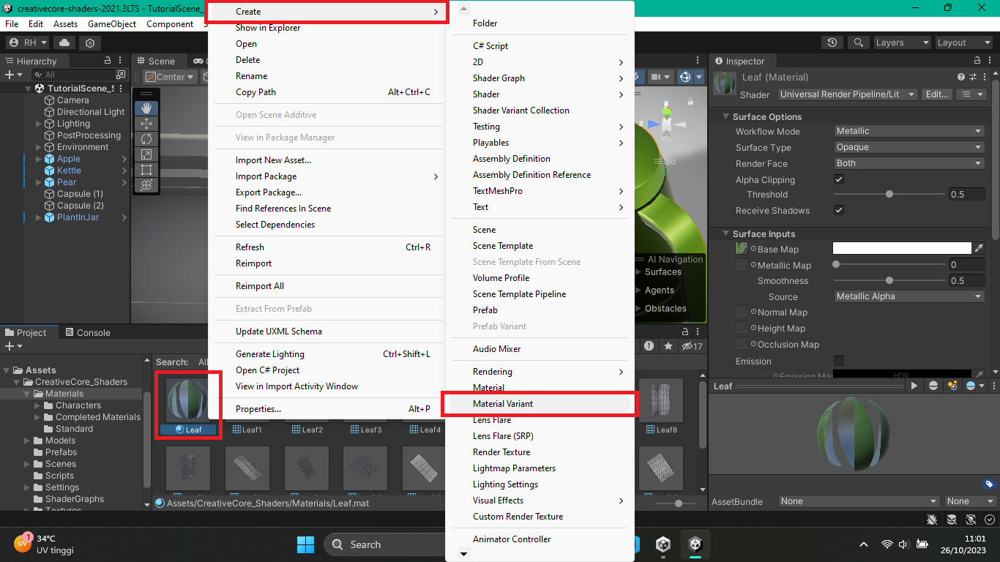
2. Add an Override on a Material Variant (modify) 
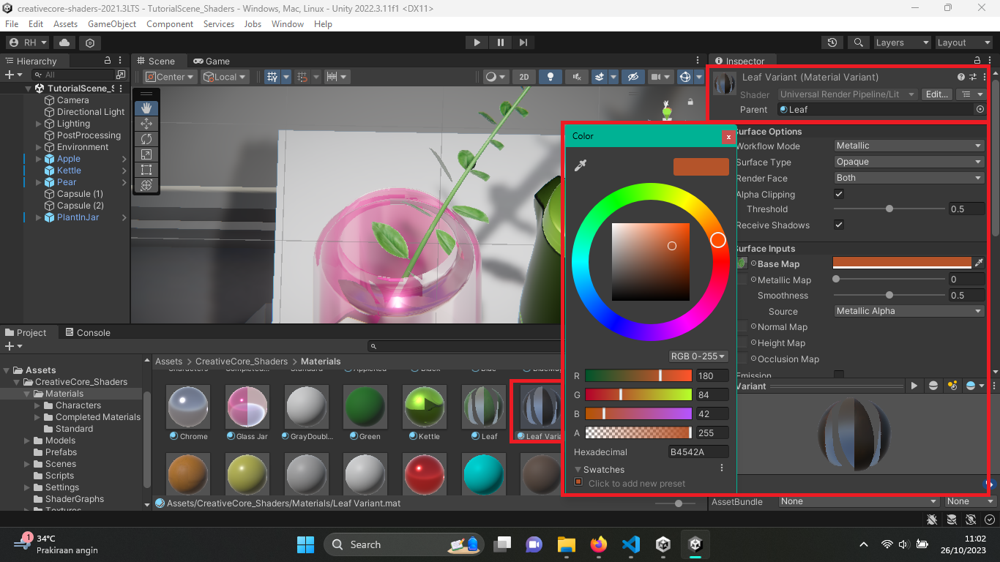
3. Material Variant applied 
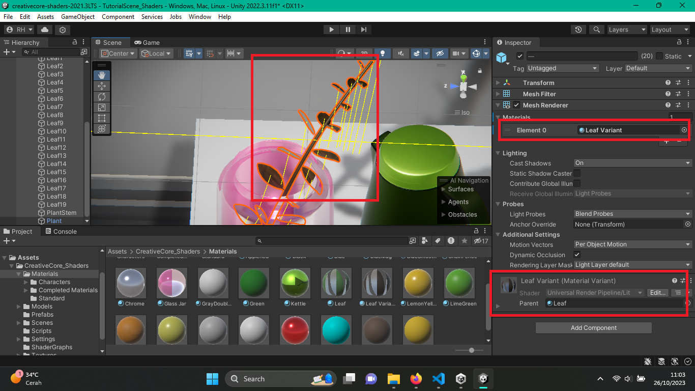
4. Modifications on parent material also changes the variants 
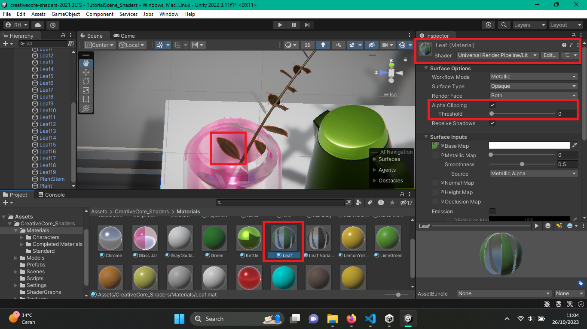